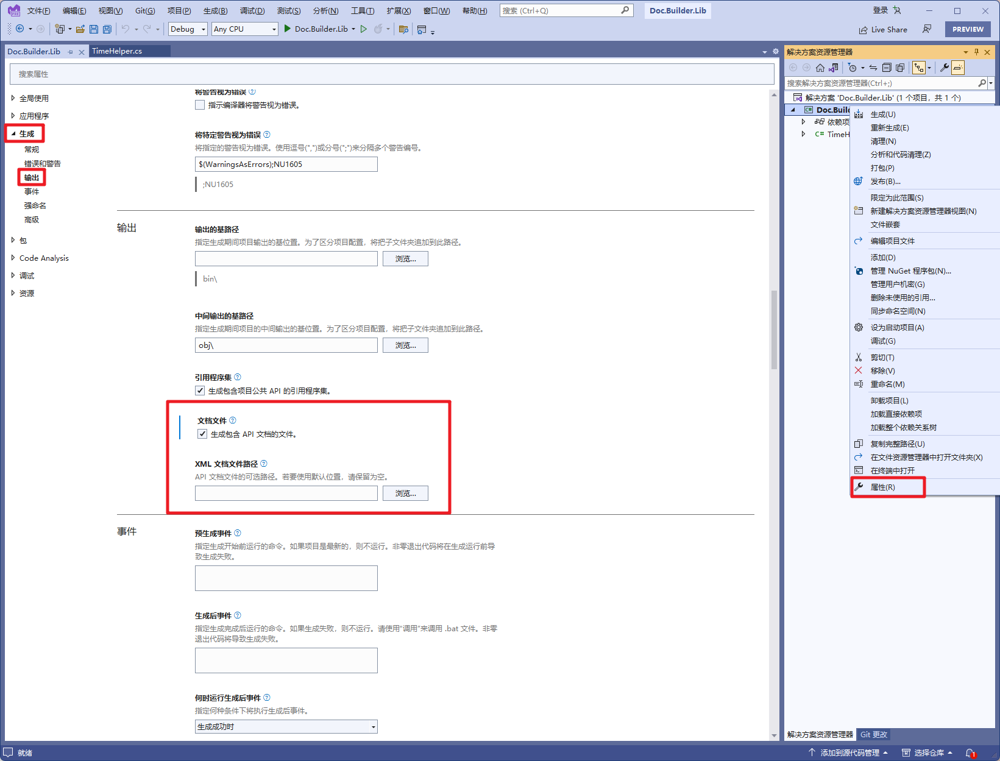
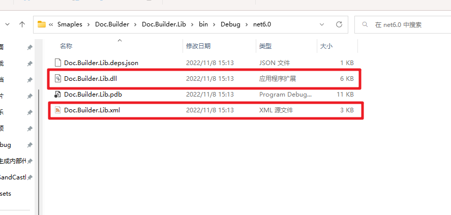
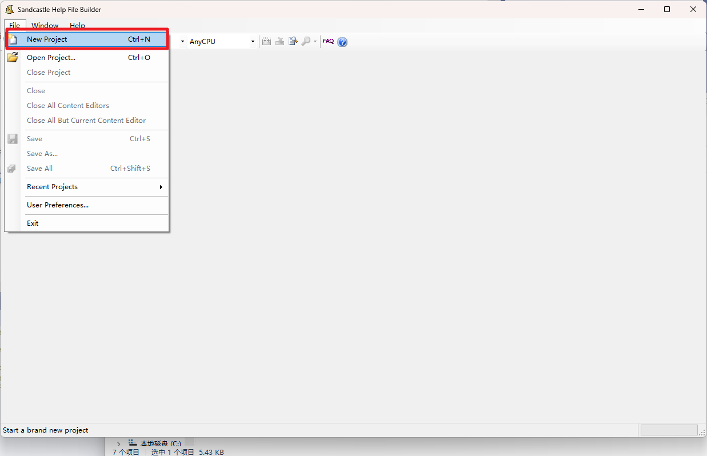
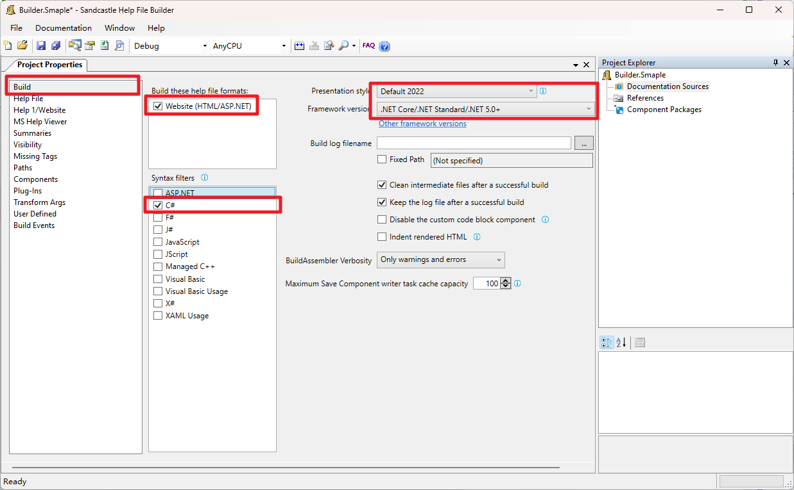
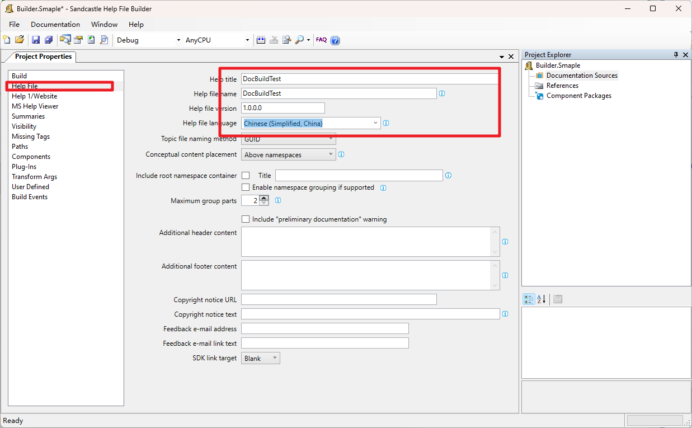
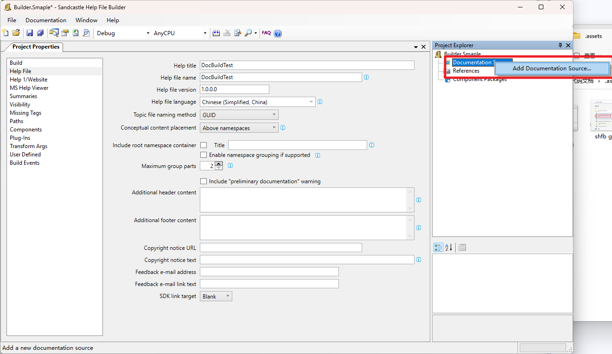
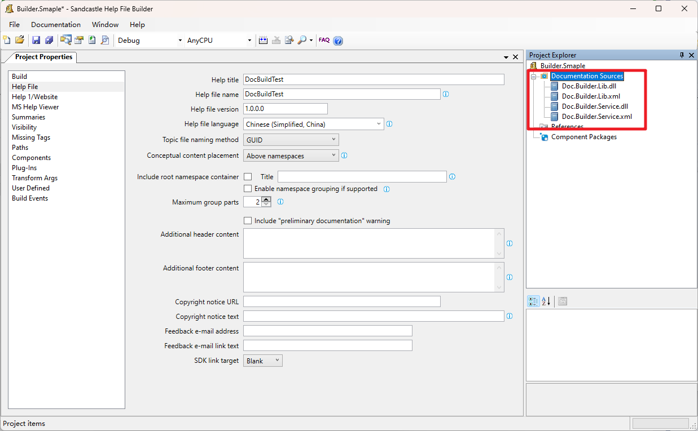
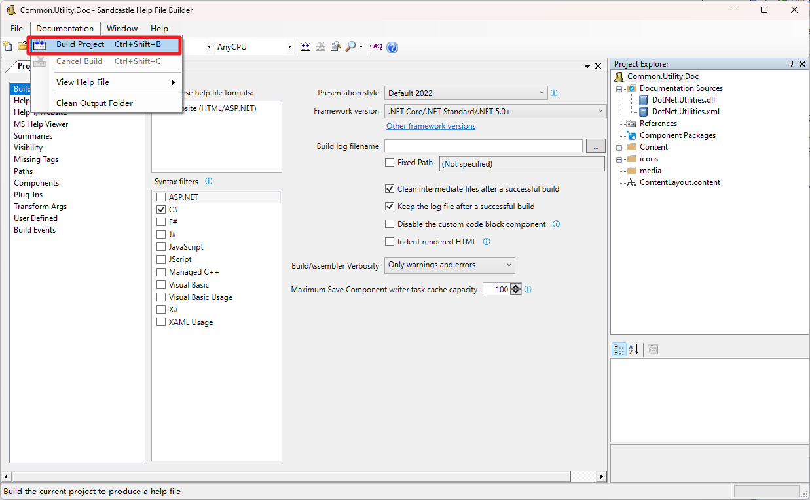
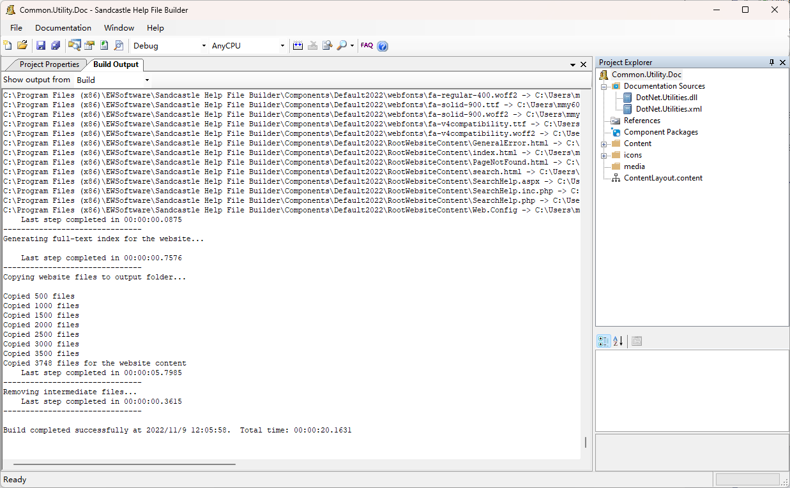
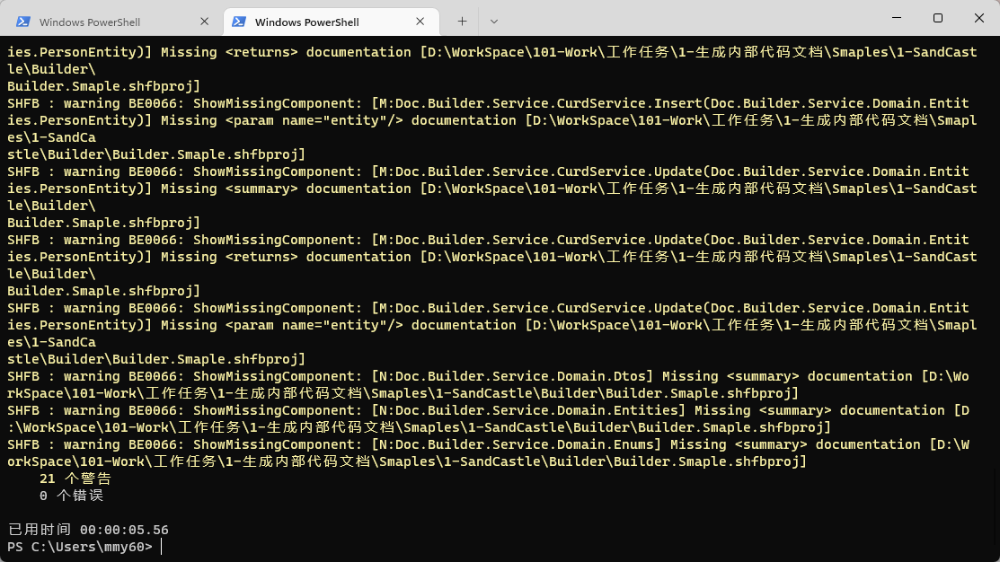

## 安装

参考：[四种Sandcastle方法生成c#.net帮助类帮助文档 - 耕云种月 - 博客园 (cnblogs.com)](https://www.cnblogs.com/anyushengcms/p/7682501.html)


## 操作

### 源码操作

#### 1-生成程序集API XML

配置需要生成的程序集API XML，默认生成到\bin\Debug\xxx下



#### 2-输出文件




### 2-创建.shfbproj项目

#### 1. 新建.shfbproj项目


#### 2. 配置项目

##### 配置build



##### 配置help file



##### 添加xml及dll 等资源文件




### 3-构建文档

#### 1. 使用shfb gui工具

##### 开始构建



##### 完成构建



#### 2. 使用cmd

> 前提：需要使用dotnet，依赖.net framework 4.8 以及安装SHFB

##### 命令

使用如下命令进行构建

```shell
# 命令格式：msbuild [.shfbproj路径]
# 默认生成文件与.shfbproj同一目录下的Help文件夹中
dotnet build D:\\Builder\\Builder.Sample.shfbproj
```
##### 完成



