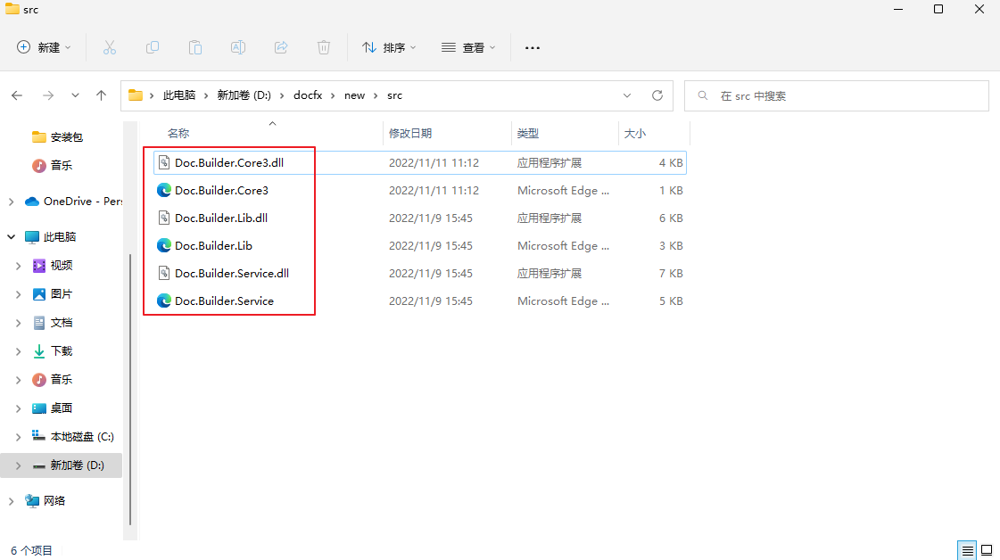

## 安装

安装包地址：[docfx releases](https://github.com/dotnet/docfx/releases/)

MSBuild是DocFX编译项目的必要环境，所以需要根据不同平台进行构建环境搭建：

- 在Windows环境下，需要使用Visual Studio Installer（vs >= 2019），单个组件 搜索 MSBuid进行安装；
- 在Linux/Mac环境下，需要安装Mono（mono >= 5.1.0）；


## 操作

## 1-初始化文档项目

源于docfx目前还不支持可视化界面配置项目，所以需要使用命令行进行项目初始化，然后编辑项目配置；

> 使用 docfx命令的前提是要配置好环境变量，否者可以在docfx.exe具体路径下执行

**校验docfx可用：**


### 1-构建项目

#### 1. 初始化DocFX项目

使用init -q命令进行快速创建项目

**项目文件相关说明：**[A seed project to play with DocFX](https://dotnet.github.io/docfx/tutorial/docfx_getting_started.html#5-a-seed-project-to-play-with-docfx)


#### 2. 将资源文件（源码 或 xml + dll资源文件）

<font color=red>注意：默认情况下，初始化的项目仅支持源码生成，并且目标文件夹路径为src，需要进行配置更改，才能支持xml资源文件生成以及源路径</font>


此处以xml + dll 为例



### 2-构建文档项目

> DocFX 目前仅支持以cmd的形式进行项目创建以及构建

使用如下命令进行构建：

```shell
docfx <docfx.json所在路径>
```


此时，项目目录下会生成名为`_site`的目录，该目录生成的为Website文档；

也可以使用`docfx serve` 命令托管Website

```
docfx serve <website路径>
```


### 3-更改关键字显示

#### 方式1 - 使用官方默认的语言模板：

目前支持英文、中文

在配置中修改如下（将`default`变更为`default(zh-cn)`）：

<font color=red>**目前会存在编译警告导致输出文件失败，已经提交了issue**</font>


#### 方式2 - 替换语言模板文件：

##### 1. 创建关键字对应文件

中文文件：[docfx/token.json at dev · dotnet/docfx (github.com)](https://github.com/dotnet/docfx/blob/dev/src/docfx.website.themes/default(zh-cn)/token.json)

创建`templates`文件夹，并将上述的`token.json`(固定名称，不能更改)文件加入`templates`目录下

##### 2. 更改配置文件

在配置中修改如下（添加刚刚文件的`templates`目录）：


**此时再去重新生成即可**

### 4-变更主题

##### 1. 创建模板文件夹

创建`templates`文件夹，并将主题文件加入`templates`目录下

#### 2. 更改配置文件

在配置中修改如下（添加主题文件路径到`template`中的`templates/<主题文件夹名>`）：


**此时再去重新生成即可**

## 其他 

**主题：**[Available templates and themes](https://dotnet.github.io/docfx/templates-and-plugins/templates-dashboard.html)

